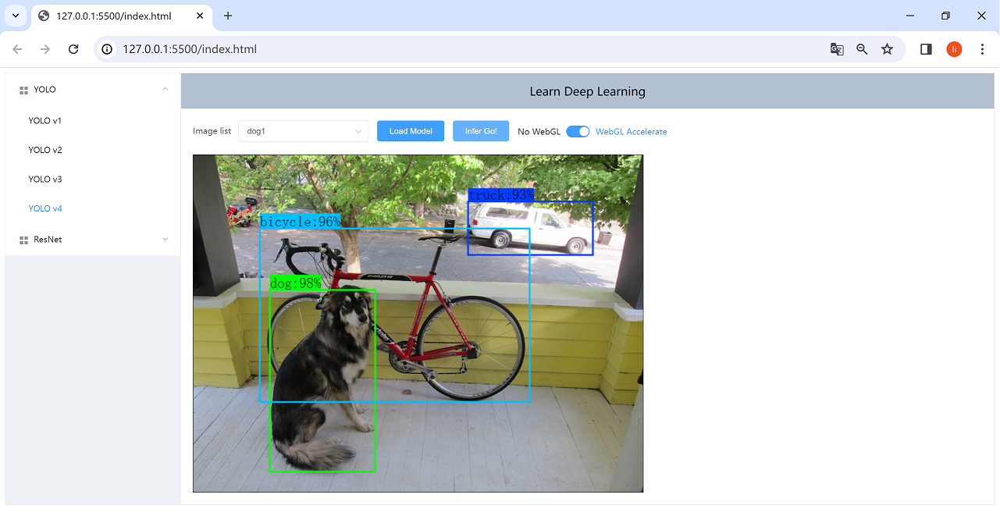

# Machine Learning

## Getting started

YOLOv1, YOLOv2, YOLOv3, YOLOv4 and Resnet demos written in javascript, which runs in web context.

## Run the app

1. download all the model structure configs and weight files from [google drive](https://drive.google.com/drive/folders/1dyv--s6mhCYQcqiLpvFUzGicW0bvK9_7?usp=drive_link). Move the downloaded files to the folder ./data/models
2. install VSCode `Live Server` extension. (Optional )
3. open the `index.html` file with `Live Server` extension, or other HTTP server.

## Screen Shots

1. 

2. 
